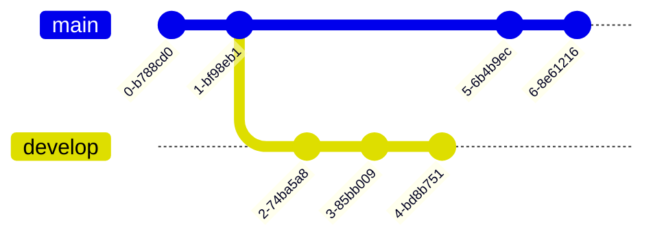

# Markdown Evolution Proposals

This document will approach three types of proposals to evolve the [Markdown Syntax](https://daringfireball.net/projects/markdown/syntax).

- **patch:** these proposals are compatible with the current markdown and their transpilers.
- **superset:** the proposals here are an evolution that accept the current syntax and new features.
- **breaking change:** a new version that override the old markdown syntax

Each type of proposal is divided in two use cases:

- **for document:** the original reason to markdown exist, to be a web markup language to create text documents
- **for web pages:** Markdown is an HTML superset, the idea is to make it render more complex pages, no only documents, then these proposal bring new common components for content of web pages.

## Patch

### Put markdown information at hidden places.

#### Image

Create

```md

```

```md

```

- `mdFloat`
- `mdClass`
- `mdWidth`
  - `mdWidth=50`: 50%
  - `mdWidth=200px`: 200px 
- `mdAlign`
- `mdHeight`
- `mdPreview`: Put the image inside a box like a sample, if it's placed before a code block it will create a composite component with sample and code.

#### Link

```md
[content](href?HIDDEN_INFORMATION "title")
```

```md
[The Lord of The Rings cape](#tlotr?mdType=button "title")
```

- `mdType=button`
- `mdAlign`

### Code block

```html preview
<span class="123">asd</span>
```

- `preview`: render the HTML above or below the code block

## Superset

## Other



<details>

<summary>Tips for collapsed sections</summary>

### You can add a header

You can add text within a collapsed section. 

You can add an image or a code block, too.

```ruby
   puts "Hello World"
```

</details>

$\sqrt{3x-1}+(1+x)^2$

$$\left( \sum_{k=1}^n a_k b_k \right)^2 \leq \left( \sum_{k=1}^n a_k^2 \right) \left( \sum_{k=1}^n b_k^2 \right)$$

**Here is some math!**

```math
\sqrt{3}
```

https://docs.github.com/en/get-started/writing-on-github/working-with-advanced-formatting/organizing-information-with-tables
